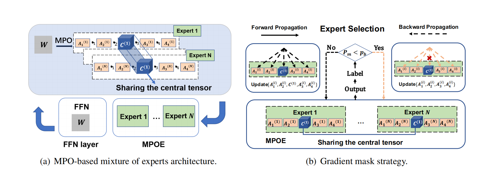

# Parameter-Efficient Mixture-of-Experts Architecture for Pre-trained Language Models
  
This is our Pytorch implementation for the paper:
> Ze-Feng Gao, Peiyu Liu, Wayne Xin Zhao, Zhong-Yi Lu and Ji-Rong Wen(2022). Parameter-Efficient Mixture-of-Experts Architecture for Pre-trained Language Models
# Introduction
Recently, Mixture-of-Experts (short as MoE) architecture has achieved remarkable success
in increasing the model capacity of large-scale language models. However, MoE requires incorporating significantly more parameters than the base model being extended. In this paper, we propose building a parameter-efficient MoE architecture by sharing information across experts. We adopt matrix product operator (MPO, a tensor decomposition from quantum  anybody physics) to reconstruct the parameter matrix in the expert layer and increase model capacity for pre-trained language models by sharing parameters of the central tensor (containing the core information) among different experts while enabling the specificity through the auxiliary tensors (complementing the central tensor) of different experts. To address the unbalanced optimization issue, we further design the gradient mask strategy for the MPO-based MoE architecture. Extensive experiments based on T5 and GPT-2 show improved performance and efficiency of the pretrained language model (27.2x reduction in total parameters for the superior model performance, compared with the Switch Transformers).

 
 
For more details about the technique of MPOE, refer to our [paper](https://arxiv.org/abs/2203.01104). The third_party implementation refers to [hyperformer](https://github.com/rabeehk/hyperformer).
 # Release Notes
 - First version: 2022/09/15

# Requirements
- python 3.7
- torch >= 1.8.0


 # Installation
 ```shell
pip install mpo_lab
 ```
## How to run?
Code Run Script `third_party/scripts/` , configuration Script `third_party/configs`. 
Just run the script focusing on the following 2 scripts. Single task run **finetune_single_task.sh** 

 - To run T5 finetuning model in a multi-task learning setup:
   ```
   bash scripts/finetune.sh
   ```

 - To run T5 finetuning model in a single-task learning setup:
   ```
   bash scripts/finetune_single_task.sh
   ```


Important arguments:
```
--data_dir          Path to load dataset
--mpo_lr            Learning rate of tensors produced by MPO
--mpo_layers        Name of components to be decomposed with MPO
--emb_trunc         Truncation number of the central tensor in word embedding layer
--linear_trunc      Truncation number of the central tensor in linear layer
--attention_trunc   Truncation number of the central tensor in attention layer
--load_layer        Name of components to be loaded from exist checkpoint file
--update_mpo_layer  Name of components to be update when training the model
```


## Acknowledgment
Any scientific publications that use our codes should cite the following paper as the reference:
```
@inproceedings{Gao-coling-2022,
  author    = {Ze{-}Feng Gao and
               Peiyu Liu and
               Wayne Xin Zhao and
               Zhong{-}Yi Lu and
               Ji{-}Rong Wen},
  title     = "Parameter-Efficient Mixture-of-Experts Architecture for Pre-trained Language Models",
  booktitle = {{COLING}},
  year      = {2022},
}
```


# 
This repo contains the PyTorch implementation of MPOE based on repo "Parameter-efficient Multi-task Fine-tuning for Transformers via Shared Hypernetworks"
[ref](https://aclanthology.org/2021.acl-long.47.pdf).
